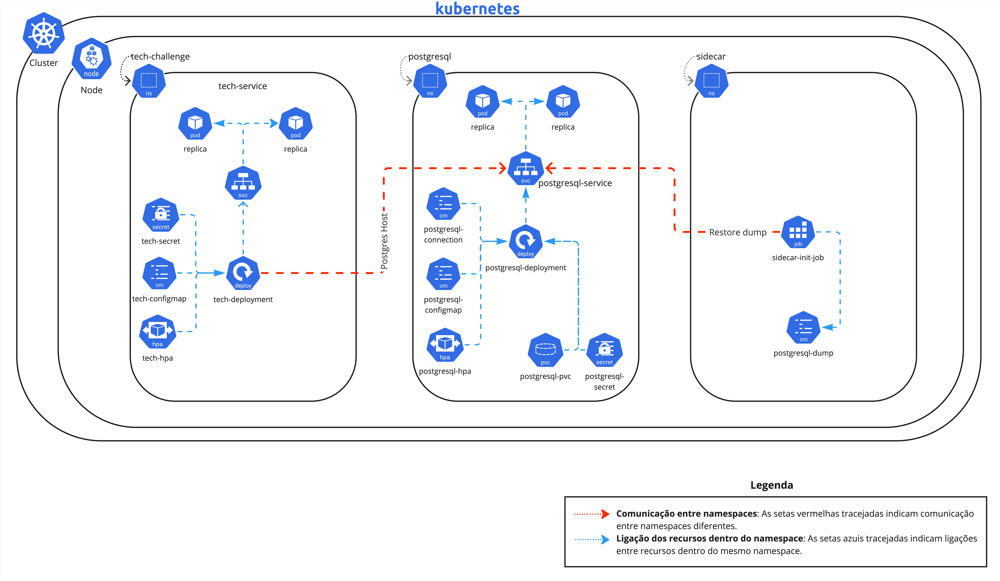

# Tech Challenge - FIAP 2024

### Descrição

Este projeto é uma aplicação Node.js estruturada com TypeScript e seguindo a arquitetura hexagonal. Utilizamos Express para criar a API, Sequelize como database connector e PostgreSQL como banco de dados relacional. O projeto está dockerizado, com suporte a Docker Compose para facilitar o processo de desenvolvimento e implantação.

### Tecnologias do Projeto

| Docker | PostgreSQL | Node.js  | NPM    |
|--------|------------|----------|--------|
| *      | *          | v16.15.0 | v8.5.5 |

### Membros do Projeto

| Nome             | RM        |
|------------------|-----------|
| Davi Corazza     | RM353340  |
| Francisco Wesley | RM353738  |
| Pedro Freitas    | RM353284  |
| Robson Anjos     | RM353341  |

#### `Link do Miro` - Documentação do sistema (DDD) com Event Storming, incluindo todos os passos/tipos de diagrama 
[Miro - Tech Challenge](https://miro.com/app/board/uXjVKWk2FRY=/?share_link_id=272701004394)


## Estrutura do Projeto

	src
	├── adapters
	│   ├── api
	│   ├── database
	├── config
	├── core
	│   ├── models
	│   ├── ports
	│   │   ├── in
	│   │   └── out
	├── ├── services
	├── ├── utils
	└── main.ts

### Mais Detalhes
- `src:` Diretório principal onde o código fonte da aplicação está localizado.
	- `adapters:` Contém implementações de conexões externas.
		- `api:` Implementações relacionadas às rotas e controllers da API.
		- `database:` Configurações e implementações relacionadas ao banco de dados.
	- `config:` Arquivos de configuração da aplicação, bem como express, fator de conexão, morgan e swagger.
	- `core:` Contém a lógica de negócios da aplicação.
		- `models:` Definições dos modelos/entidades para uso na camada core.
		- `ports:` Definição de interfaces para entrada e saída.
			- `in:` Interfaces para services e controllers.
			- `out:` Interfaces para repositórios e gateways.
		- `services:` Implementação dos casos de uso e lógica de negócio.
		- `utils:` Utilitários e helpers genéricos.
	- `main.ts:` Ponto de entrada da aplicação.

## Iniciando a aplicação
- Clone o repositório:

		git clone https://github.com/davi-corazza/tech-challenge.git
		cd tech-challenge

- Construa e inicie os containers:

	*	Para Windows:

			docker-compose up --build

	*	Para Linux e macOS:

			docker compose up --build

- A aplicação estará disponível em http://localhost:3000.

## Documentação da API
A documentação da API, gerada com Swagger, estará disponível em http://localhost:3000/swagger/.

## Cluster Kubernetes
- O cluster Kubernetes foi configurado utilizando o Docker Desktop, por isso está com um node.
- Os recursos foram separados em namespaces para melhor organização. A comunicação entre os namespaces é feita através de serviços.
- O banco de dados PostgreSQL foi configurado em um namespace separado, com um serviço para comunicação com a aplicação.
- Para realizar o restore do banco de dados, foi criado um job sidecar-init que restaura o banco de dados com o dump dump.sql que está em um ConfigMap.

## Estrutura do Cluster Kubernetes

```
├── Application
│   ├── tech-configmap.yaml
│   ├── tech-deployment.yaml
│   ├── tech-hpa.yaml
│   ├── tech-namespace.yaml
│   ├── tech-role-binding.yaml
│   ├── tech-role.yaml
│   ├── tech-secret.yaml
│   ├── tech-service-account.yaml
│   └── tech-service.yaml
├── PostgreSQL
│   ├── postgresql-configmap.yaml
│   ├── postgresql-connection.yaml
│   ├── postgresql-deployment.yaml
│   ├── postgresql-hpa.yaml
│   ├── postgresql-namespace.yaml
│   ├── postgresql-pvc.yaml
│   ├── postgresql-role-binding.yaml
│   ├── postgresql-role.yaml
│   ├── postgresql-secret.yaml
│   ├── postgresql-service-account.yaml
│   └── postgresql-service.yaml
└── Test-k6s
    ├── index.js  -> Script de teste de carga
    └── tech-challenge-report.pdf -> Relatório do teste de carga
```

## Diagrama da Arquitetura

A imagem abaixo ilustra a arquitetura do cluster Kubernetes, com os namespaces e serviços configurados.




## Link do Video de Apresentação

O vídeo de apresentação do projeto está disponível no YouTube. Nele, apresentamos a aplicação, a arquitetura do cluster Kubernetes e os resultados do teste de carga.

[Video de Apresentação](https://www.youtube.com/watch?v=CQdSKTqmasw)

## Resultado do Teste de Carga com K6s

Realizamos um teste de carga utilizando K6s para avaliar o desempenho e a capacidade de nosso sistema. O relatório detalhado dos resultados pode ser acessado através do link abaixo:

[Veja o Relatório Completo do Teste de Carga](kubernetes/Test-k6s/tech-challenge-report.pdf)


